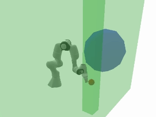
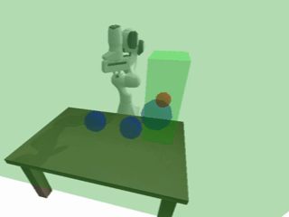
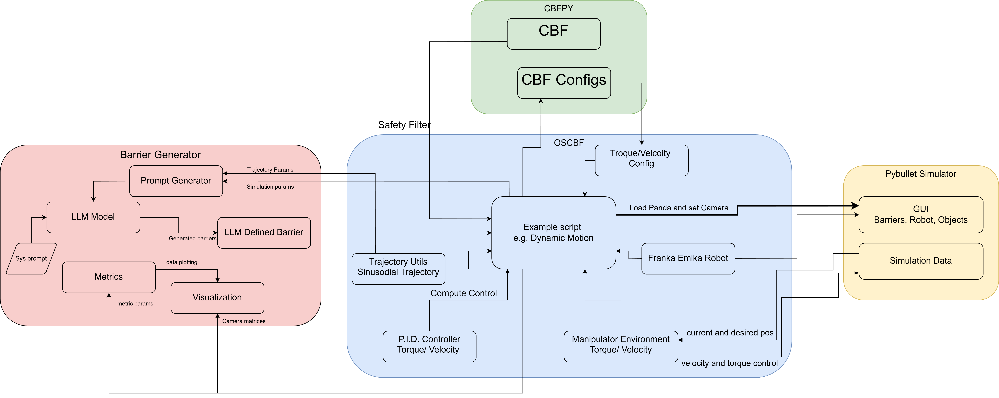
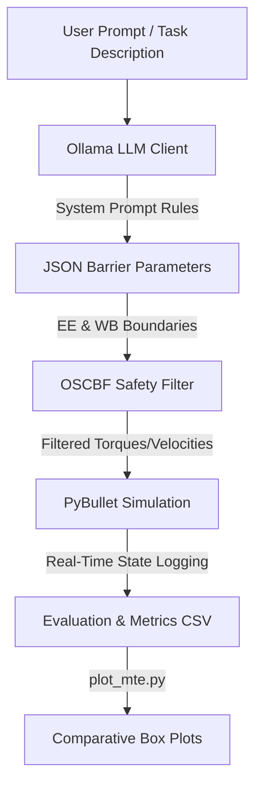

# Operational Space Control Barrier Functions (OSCBF) with LLM-Generated Safety Barriers

Code and evaluation framework for integrating Large Language Models (LLMs) with **Operational Space Control Barrier Functions (OSCBF)** to synthesize safe, real-time controllers for robotic manipulators (specifically the Franka Emika Panda).

This project extends the original OSCBF framework (*"Safe, Task-Consistent Manipulation with Operational Space Control Barrier Functions"* -- Daniel Morton and Marco Pavone, accepted to IROS 2025) by adding an LLM-in-the-loop pipeline that automatically generates safety boundaries from natural language descriptions of the robot workspace, task trajectory, and obstacles.

---

## 🎬 Simulation Results

Here are the PyBullet simulation results under various safety-critical operational conditions with LLM-generated barriers:

| **Dynamic Motion Tracking** | **Multiple Safety Conditions** |
|:---:|:---:|
|  |  |
| *Sinusoidal trajectory tracking with LLM-generated boundary* | *Joint limit, singularity, and workspace boundary compliance* |

| **Cluttered Tabletop Manipulation** | **Custom Tabletop Scenario** |
|:---:|:---:|
|  |  |
| *Pick-and-place tracking with spherical obstacle avoidance* | *Custom layout manipulation avoiding restricted zones* |

---

## 🚀 Key Features

* **LLM-in-the-loop Barrier Generation**: Automatically translates environment descriptions, target trajectories, and obstacle coordinates into mathematically certified Control Barrier Functions (CBFs).
* **Dual-Barrier System**:
  * **EE (End-Effector) Barrier**: Minimal bounding box enclosing the target trajectory and end-effector paths.
  * **WB (Whole-body) Barrier**: Broader bounding box protecting the entire arm sweep (including the base and links) and shrinking to avoid obstacles.
* **OSCBF Safety Filtering**: Evaluates safety constraints at kilohertz speeds, filtering nominal control inputs (torque or velocity) to ensure safety.
* **Extensive Evaluation Suite**: Built-in scripts to evaluate tracking error, safety violations, torque effort, and barrier activation rates across multiple models (Llama 3.1, Gemma 4, Qwen 3.5) and prompting versions.

---

## 🛠️ Project Pipeline





---

## 📁 Repository Structure

```
├── barriertransformer/          # Core modules for LLM prompting & metrics
│   ├── barrier_generate.py      # LLM prompts (v1, v1.5, v2, pnp) & Ollama wrapper
│   ├── metrics.py               # Evaluation metrics computation (MTE, SVR, etc.)
│   └── visualization.py         # Matplotlib plotting helper functions
├── cbf_clone/                   # Local fork of the core CBFpy package
├── llm_gen/                     # Jupyter notebooks & scripts testing structured LLM output
├── oscbf/                       # The Operational Space Control Barrier Function core controller
│   ├── core/                    # Manipulator models, controller logic, and environments
│   └── examples/                # PyBullet simulation examples (dynamic motion, tabletop)
├── results/                     # Experimental outputs, boxplots, logs, and video captures
│   ├── mte_boxplots/            # Generated box plots comparing LLM models
│   └── mte_raw_data.csv         # Aggregated benchmark data
├── fill_mte_csv.py              # Script to aggregate simulation results into mte_raw_data.csv
└── plot_mte.py                  # Script to plot comparative boxplots from mte_raw_data.csv
```

---

## 📑 LLM Prompting & System Prompts

The barrier generation utilizes local LLMs (run via Ollama) with structured prompt templates. The prompts have evolved to improve the precision and minimality of generated barriers:

* **`v1` (Initial Prompt)**: Basic instruction set for generating a single bounding box.
* **`v1.5` (Intermediate Prompt)**: Separation of EE and WB barriers with basic collision avoidance logic.
* **`v2` (Sinusoidal - Sinusoid Range & Collision Focus)**: Structured rules constraining body barriers strictly to the robot's physical reach, shrinking only the face intersecting collision objects.
* **`pnp` (Pick and Place - Flat Waypoint Path)**: Tailored for sequential discrete motions. Scans all waypoints, identifies coordinate extremes, adds precise buffers, and centers boundaries.

The LLM output is parsed into a structured Pydantic schema:
```json
{
  "reasoning": "Step-by-step reasoning details...",
  "ee_center":  [x, y, z],
  "ee_lengths": [lx, ly, lz],
  "wb_center":  [x, y, z],
  "wb_lengths": [lx, ly, lz]
}
```

---

## 📊 Evaluation Metrics

The system calculates 8 performance metrics in `barriertransformer/metrics.py` to evaluate each run:
1. **Mean Tracking Error ($\overline{\text{TE}}$)**: Mean and standard deviation of the distance between end-effector and target.
2. **Safety Violation Rate**: Fraction of the trajectory where the end-effector/whole body goes outside safe boundaries.
3. **Collision Intersection Area**: Intersecting volume between the safety barriers and obstacle collision spheres.
4. **Barrier Volume**: Computational volume of both the EE and WB barriers.
5. **Barrier Activation Rate**: The percentage of simulation steps where the safety filter overrides/adjusts the nominal control input.
6. **Joint Absolute Torque**: Mean absolute torque sent to each joint, measuring physical motor effort.
7. **Total Control Effort**: $L_2$ norm of the control input vector throughout the task.
8. **Barrier Evolution ($h(t)$)**: Logs safety margin values over time.

---

## ⚙️ Installation & Setup

1. **Clone the Repository**:
   ```bash
   git clone <repository_url>
   cd aims-project
   ```

2. **Create a Virtual Environment**:
   ```bash
   python -m venv .venv
   source .venv/bin/activate  # On Windows: .venv\Scripts\activate
   ```

3. **Install Dependencies**:
   ```bash
   pip install -r requirements.txt
   pip install -e ./oscbf
   pip install -e ./cbf_clone/cbfpy
   ```

4. **Set Up Ollama**:
   Ensure Ollama is installed and running locally. Pull the required models:
   ```bash
   ollama pull llama3.1
   ollama pull qwen3.5:35b
   ollama pull gemma2
   ```

---

## 📈 Running Demos & Benchmarks

### 1. Running Demos
You can run any of the simulation examples from the `oscbf/examples` directory:
```bash
python oscbf/examples/dynamic_motion.py --control_method torque
```
*Note: Toggle `RECORD_VIDEO = True` or `SAVE_DATA = True` inside the script to capture videos or export CSV metrics.*

### 2. Aggregating Metrics
To populate the main evaluation sheet `results/mte_raw_data.csv` with recently run simulation logs:
```bash
python fill_mte_csv.py
```

### 3. Generating Box Plots
To generate comparative model evaluation box plots from the raw data:
```bash
python plot_mte.py
```
This will generate box plots (e.g. comparing tracking errors across models/prompt versions) under `results/mte_boxplots/`.

---

## 🔗 Original Citation & Reference

If you build upon the core OSCBF control code, please cite the original work:

```bibtex
@inproceedings{morton2025oscbf,
  author={Morton, Daniel and Pavone, Marco},
  booktitle={2025 IEEE/RSJ International Conference on Intelligent Robots and Systems (IROS)}, 
  title={Safe, Task-Consistent Manipulation with Operational Space Control Barrier Functions}, 
  year={2025},
  pages={187-194},
  doi={10.1109/IROS60139.2025.11246389}
}
```
